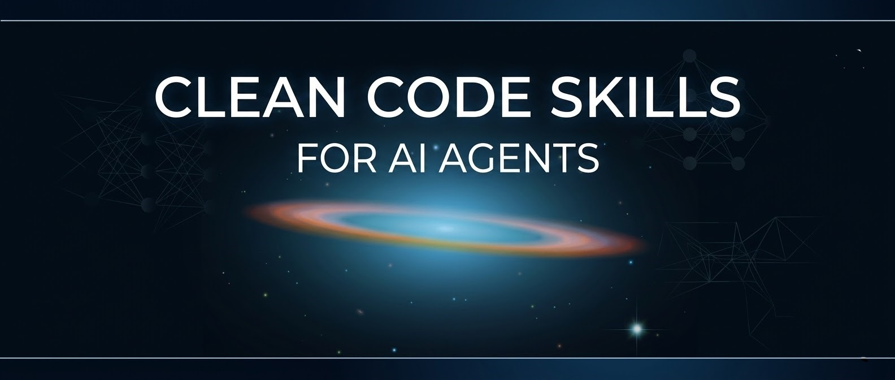

<p align="center">
  
</p>

<h1 align="center">Clean Code Skills for AI Agents</h1>

<p align="center">
Teach your AI to write code that doesn't suck — in any language.
</p>

<p align="center">
    <a href="https://agentskills.io"></a>
    <a href="LICENSE"></a>
  
</p>

<p align="center">
  
  
  
</p>

This repository contains [Agent Skills](https://agentskills.io) that enforce Robert C. Martin's *Clean Code* principles for  **Python**,  **Java**,  **TypeScript**,  **JavaScript**,  **Go**,  **Rust**, and  **C#**. They work with Google Antigravity, Anthropic's Claude Code, and any agent that supports the Agent Skills standard.

Each language gets its own set of 6 skills (1 master + 5 category skills), all sharing the same universal Clean Code rules (C1-C5, F1-F4, G1-G36, N1-N7, T1-T9) while adding language-specific idioms and modern features.

## Why?

AI generates code fast, but research shows it also generates technical debt fast:

- **GitClear**: 4x increase in code duplication with AI adoption
- **Carnegie Mellon**: +30% static analysis warnings, +41% code complexity after Cursor adoption
- **Google DORA**: Negative relationship between AI adoption and software delivery stability

These skills encode battle-tested solutions to exactly these problems—directly into your AI workflow.

## What's Included

### Overview

| Language | Master Skill | Category Skills | Language-Specific Rules |
| ---------- | ------------- | ----------------- | ------------------------ |
| **Python** | `python-clean-code` | `python-clean-names`, `python-clean-functions`, `python-clean-comments`, `python-clean-general`, `python-clean-tests` | P1-P3 |
| **Java** | `java-clean-code` | `java-clean-names`, `java-clean-functions`, `java-clean-comments`, `java-clean-general`, `java-clean-tests` | J1-J10 |
| **TypeScript** | `typescript-clean-code` | `typescript-clean-names`, `typescript-clean-functions`, `typescript-clean-comments`, `typescript-clean-general`, `typescript-clean-tests` | TS1-TS8 |
| **JavaScript** | `javascript-clean-code` | `javascript-clean-names`, `javascript-clean-functions`, `javascript-clean-comments`, `javascript-clean-general`, `javascript-clean-tests` | JS1-JS7 |
| **Go** | `go-clean-code` | `go-clean-names`, `go-clean-functions`, `go-clean-comments`, `go-clean-general`, `go-clean-tests` | GO1-GO8 |
| **Rust** | `rust-clean-code` | `rust-clean-names`, `rust-clean-functions`, `rust-clean-comments`, `rust-clean-general`, `rust-clean-tests` | RS1-RS8 |
| **C#** | `csharp-clean-code` | `csharp-clean-names`, `csharp-clean-functions`, `csharp-clean-comments`, `csharp-clean-general`, `csharp-clean-tests` | CS1-CS8 |

Plus the language-agnostic **`boy-scout`** orchestrator that coordinates all skills.

### Skills by Category

| Skill Category | Description | Rules |
| ---------------- | ------------- | ------- |
| `{lang}-clean-code` | **Master skill** with all rules for the language | C1-C5, E1-E2, F1-F4, G1-G36, N1-N7, T1-T9 + language-specific |
| `{lang}-clean-names` | Descriptive, unambiguous naming | N1-N7 |
| `{lang}-clean-functions` | Small, focused, obvious functions | F1-F4 |
| `{lang}-clean-comments` | Minimal, accurate commenting | C1-C5 |
| `{lang}-clean-general` | Core principles (DRY, single responsibility) | G5, G16, G23, G25, G30, G36 |
| `{lang}-clean-tests` | Fast, thorough, boundary-aware tests | T1-T9 |
| `boy-scout` | **Orchestrator** — always leave code cleaner | Coordinates all skills |

### Language-Specific Rules

Each language extends the universal Clean Code catalog with idiomatic rules:

#### Python (P1-P3)

- P1: No wildcard imports — P2: Use Enums — P3: Type hints on public interfaces

#### Java (J1-J10)

- J1: Records for data classes — J2: Sealed classes — J3: Pattern matching in switch — J4: Optional, never null — J5: Text blocks — J6: Virtual threads — J7: Google Java Style — J8: Always `@Override` — J9: Enums not integer constants — J10: Javadoc for public APIs

#### TypeScript (TS1-TS8)

- TS1: `unknown` over `any` — TS2: `type` over `interface` — TS3: Discriminated unions — TS4: `as const satisfies` — TS5: `readonly` for immutability — TS6: `import type` — TS7: Descriptive generics — TS8: `@ts-expect-error` over `@ts-ignore`

#### JavaScript (JS1-JS7)

- JS1: `const` by default, never `var` — JS2: Object destructuring — JS3: async/await — JS4: ES6+ classes — JS5: Functional patterns — JS6: `===` strict equality — JS7: Default parameters

#### Go (GO1-GO8)

- GO1: PascalCase exported, camelCase local — GO2: Accept interfaces, return structs — GO3: Always check and wrap errors — GO4: `go fmt` is non-negotiable — GO5: Small interfaces (1-2 methods) — GO6: `defer` for cleanup — GO7: Goroutine safety with context — GO8: Table-driven tests

#### Rust (RS1-RS8)

- RS1: Borrow before clone — RS2: `Result`/`Option`, never panic — RS3: Derive standard traits — RS4: Iterators over manual loops — RS5: `cargo clippy` zero warnings — RS6: Exhaustive pattern matching — RS7: `thiserror`/`anyhow` for errors — RS8: Minimize `unsafe`

#### C# (CS1-CS8)

- CS1: Properties, not public fields — CS2: LINQ over manual loops — CS3: async/await, never `.Result` — CS4: Records for immutable data — CS5: Nullable reference types enabled — CS6: Pattern matching switch expressions — CS7: `using` declarations — CS8: Primary constructors for DI

Use the master skill for comprehensive coverage, or individual skills for targeted enforcement.

### The Boy Scout Rule

The `boy-scout` skill embodies Clean Code's core philosophy:

> "Always check a module in cleaner than when you checked it out."

You don't have to make code perfect—just **a little bit better** with every touch. The `boy-scout` skill orchestrates the others, ensuring every code interaction leaves a trail of small improvements.

---

## Installation

### Google Antigravity

**Project-specific** (applies to one project):

```bash
# From your project root
mkdir -p .agent/skills
cp -r skills/* .agent/skills/
```

**Global** (applies to all projects):

```bash
mkdir -p ~/.gemini/antigravity/skills
cp -r skills/* ~/.gemini/antigravity/skills/
```

**Quick install** (global, one command):

```bash
git clone https://github.com/ertugrul-dmr/clean-code-skills.git /tmp/clean-code-skills && \
mkdir -p ~/.gemini/antigravity/skills && \
cp -r /tmp/clean-code-skills/skills/* ~/.gemini/antigravity/skills/ && \
rm -rf /tmp/clean-code-skills
```

### Anthropic Claude Code

**Project-specific**:

```bash
# From your project root
mkdir -p .claude/skills
cp -r skills/* .claude/skills/
```

**Global**:

```bash
mkdir -p ~/.claude/skills
cp -r skills/* ~/.claude/skills/
```

**Quick install** (global, one command):

```bash
git clone https://github.com/ertugrul-dmr/clean-code-skills.git /tmp/clean-code-skills && \
mkdir -p ~/.claude/skills && \
cp -r /tmp/clean-code-skills/skills/* ~/.claude/skills/ && \
rm -rf /tmp/clean-code-skills
```

### GitHub Copilot (VS Code)

**Project-specific** (applies to one project):

```bash
# From your project root
mkdir -p .copilot/skills
cp -r skills/* .copilot/skills/
```

Copilot will automatically discover skills in `.copilot/skills/` and `.github/copilot-skills/`.

**Global** (applies to all projects):

```bash
# Windows (PowerShell)
mkdir -Force "$env:USERPROFILE\.copilot\skills"
Copy-Item -Recurse skills\* "$env:USERPROFILE\.copilot\skills\"

# macOS/Linux
mkdir -p ~/.copilot/skills
cp -r skills/* ~/.copilot/skills/
```

**Quick install** (global, one command — macOS/Linux):

```bash
git clone https://github.com/ertugrul-dmr/clean-code-skills.git /tmp/clean-code-skills && \
mkdir -p ~/.copilot/skills && \
cp -r /tmp/clean-code-skills/skills/* ~/.copilot/skills/ && \
rm -rf /tmp/clean-code-skills
```

You can also add skills as Custom Instructions by copying the content of a `SKILL.md` file into `.github/copilot-instructions.md` at the root of your project.

### Other Agent Skills-Compatible Tools

The skills follow the [Agent Skills](https://agentskills.io) open standard. Check your tool's documentation for the skills directory location, then copy the `skills/` folder contents there.

---

## Usage

Once installed, skills activate automatically based on context. Ask your agent to:

- **Write code**: "Create a user authentication module" → Skills enforce clean patterns
- **Review code**: "Review this function for issues" → Agent identifies violations by rule number
- **Refactor**: "Refactor this to be cleaner" → Agent applies all relevant rules

### Example

**Before** (10 violations):

```python
from utils import *  # P1

# Author: John, Modified: 2024-01-15  # C1
def proc(d, t, flag=False):  # N1, F1, F3
    # Process the data  # C3
    x = []  # N1
    for i in d:
        if flag:  # F3
            if i['type'] == 'A':  # G23
                x.append(i['val'] * 1.0825)  # G25
            elif i['type'] == 'B':
                x.append(i['val'] * 1.05)  # G25
        else:
            x.append(i['val'])
    return x
```

**After** (with skills active):

```python
import json
from dataclasses import dataclass
from typing import Literal

TAX_RATE_CA = 0.0825
TAX_RATE_NY = 0.05
TransactionType = Literal['CA', 'NY']

@dataclass
class Transaction:
    value: float
    type: TransactionType

def apply_tax(transaction: Transaction) -> float:
    """Apply state-specific tax to transaction value."""
    tax_rates = {'CA': TAX_RATE_CA, 'NY': TAX_RATE_NY}
    return transaction.value * (1 + tax_rates[transaction.type])

def process_transactions_with_tax(transactions: list[Transaction]) -> list[float]:
    """Calculate taxed values for all transactions."""
    return [apply_tax(t) for t in transactions]

def process_transactions_without_tax(transactions: list[Transaction]) -> list[float]:
    """Extract raw values from all transactions."""
    return [t.value for t in transactions]
```

---

## Rule Reference

All rules are documented in each skill's `SKILL.md` file. The universal rules (C1-C5, F1-F4, G1-G36, N1-N7, T1-T9) and language-specific rules are summarized in the [Language-Specific Rules](#language-specific-rules) section above. Open any `skills/{lang}-clean-code/SKILL.md` for the full reference with examples and anti-patterns.

---

## Customization

### Using Individual Skills

Don't need all 66 rules? Copy only the skills you want:

```bash
# Just Java skills
cp -r skills/java-clean-* ~/.gemini/antigravity/skills/

# Just TypeScript function rules
cp -r skills/typescript-clean-functions ~/.claude/skills/

# Just the orchestrator + one language
cp -r skills/boy-scout skills/python-clean-* ~/.claude/skills/
```

### Extending Skills

Add your own rules by editing the `SKILL.md` files or creating new skill folders:

```text
skills/
├── boy-scout/                      # Orchestrator (all languages)
│   └── SKILL.md
├── python-clean-code/              # Python master
│   └── SKILL.md
├── python-clean-names/
│   └── SKILL.md
├── java-clean-code/                # Java master
│   └── SKILL.md
├── java-clean-names/
│   └── SKILL.md
├── typescript-clean-code/          # TypeScript master
│   └── SKILL.md
├── javascript-clean-code/          # JavaScript master
│   └── SKILL.md
├── go-clean-code/                  # Go master
│   └── SKILL.md
├── rust-clean-code/                # Rust master
│   └── SKILL.md
├── csharp-clean-code/              # C# master
│   └── SKILL.md
│   ... (5 category skills per language)
└── my-team-standards/              # Your custom skill
    └── SKILL.md
```

### Adding Enforcement Scripts

For stricter enforcement, add a `scripts/` folder with linters the agent can run:

```text
skills/python-clean-code/
├── SKILL.md
└── scripts/
    └── lint.py
```

---

## How Skills Work

Skills use **Progressive Disclosure**:

1. **Discovery**: Agent sees only skill names and descriptions
2. **Activation**: When your request matches a description, full instructions load
3. **Execution**: Scripts and templates load only when needed

This keeps the agent fast—it's not thinking about database migrations when you're writing a React component.

---

## Contributing

PRs welcome! Some ideas:

- [x] ~~Additional language support~~ — Java, TypeScript, JavaScript added!
- [x] ~~Additional language support~~ — Go, Rust, C# added!
- [ ] SOLID principles as dedicated skills
- [ ] Framework-specific skills (React, Angular, Spring Boot)
- [ ] Integration tests
- [ ] Pre-commit hooks
- [ ] IDE extensions

---

## Resources

### Books

- [*Clean Code*](https://www.amazon.com/Clean-Code-Handbook-Software-Craftsmanship/dp/0132350882) by Robert C. Martin
- [*Effective Java* (3rd Edition)](https://www.amazon.com/Effective-Java-Joshua-Bloch/dp/0134685997) by Joshua Bloch

### Clean Code Repos (sources for language skills)

- [clean-code-python](https://github.com/zedr/clean-code-python) — Python clean code guide adapted from Robert C. Martin's book (4.8k+ stars)
- [clean-code-javascript](https://github.com/ryanmcdermott/clean-code-javascript) — JavaScript clean code guide by Ryan McDermott
- [clean-code-typescript](https://github.com/labs42io/clean-code-typescript) — TypeScript adaptation by labs42io
- [TypeScript Style Guide](https://github.com/mkosir/typescript-style-guide) — Modern opinionated TS conventions by Marko Kosir
- [clean-code-java](https://github.com/leonardolemie/clean-code-java) — Java adaptation by Leonardo Lemie
- [python-patterns](https://github.com/faif/python-patterns) — A collection of design patterns and idioms in Python (42.8k+ stars)

### Style Guides & Standards

- [Google Java Style Guide](https://google.github.io/styleguide/javaguide.html) — Formatting, naming, Javadoc conventions
- [Java Clean Code: Modern Practices for 2025](https://atruedev.com/blog/java-clean-code) — Records, sealed classes, virtual threads
- [The Hitchhiker's Guide to Python — Code Style](https://docs.python-guide.org/writing/style/) — PEP 8, idioms, and conventions
- [quantifiedcode/python-anti-patterns](https://github.com/quantifiedcode/python-anti-patterns) — Categorized Python anti-patterns book

### Go, Rust, C# References

- [Effective Go](https://go.dev/doc/effective_go) — Official Go best practices
- [Go Code Review Comments](https://github.com/golang/go/wiki/CodeReviewComments) — Go community conventions
- [The Rust Programming Language](https://doc.rust-lang.org/book/) — Official Rust book
- [Rust API Guidelines](https://rust-lang.github.io/api-guidelines/) — Naming, interoperability, documentation
- [C# Coding Conventions](https://learn.microsoft.com/en-us/dotnet/csharp/fundamentals/coding-style/coding-conventions) — Microsoft official style
- [.NET Framework Design Guidelines](https://learn.microsoft.com/en-us/dotnet/standard/design-guidelines/) — Naming, type design, member design

### Tools & Platforms

- [Agent Skills Standard](https://agentskills.io)
- [Antigravity Documentation](https://developers.google.com/antigravity)
- [Claude Code Documentation](https://docs.anthropic.com/claude-code)

---

## License

MIT License. See [LICENSE](LICENSE) for details.

---

*The future of programming is human intent translated by AI. Make sure the translation preserves quality, not just speed.*
